# MDA Runner Architecture

Visual overview of the consumer-based dispatch system introduced in `_runner.py`
and `_dispatch.py`. Each section below is a standalone Mermaid diagram.

---

## 1. System Architecture

High-level view: the runner thread produces frames, the dispatcher fans them out
to per-consumer worker threads, each with its own bounded queue.

```mermaid
graph TB
    subgraph User["User / Application"]
        API["mmc.mda.run(events,<br/>consumers=[...],<br/>policy=RunPolicy())"]
    end

    subgraph RunnerThread["Runner Thread"]
        direction TB
        PREP["_prepare_to_run()<br/><i>engine.setup_sequence()</i>"]
        DSTART["dispatcher.start()<br/><i>consumer.setup() for each</i>"]
        SIG_START(["sequenceStarted ⚡"])
        LOOP["Event Loop<br/><b>_run()</b>"]
        DCLOSE["dispatcher.close()<br/><i>drain queues, consumer.finish()</i>"]
        FINISH["_finish_run()<br/><i>engine.teardown_sequence()</i>"]
        SIG_FINISH(["sequenceFinished ⚡"])
        REPORT["return RunReport"]

        PREP --> DSTART --> SIG_START --> LOOP
        LOOP --> DCLOSE --> FINISH --> SIG_FINISH --> REPORT
    end

    subgraph EventLoop["Event Loop Detail"]
        direction TB
        WAIT["_wait_until_event()<br/><i>pause/cancel/timing</i>"]
        ENG_SETUP["engine.setup_event()"]
        ENG_EXEC["engine.exec_event()"]
        ITER["_iter_with_signals()<br/><i>generator.send(signal)</i>"]
        EMIT(["frameReady.emit() ⚡<br/><i>on runner thread</i>"])
        DISPATCH["dispatcher.submit(img, event, meta)"]
        CHECK{"dispatcher<br/>.should_cancel()?"}
        NEXT["next event"]

        WAIT --> ENG_SETUP --> ENG_EXEC --> ITER
        ITER --> EMIT --> DISPATCH --> CHECK
        CHECK -- no --> NEXT --> WAIT
        CHECK -- yes --> CANCEL["self._canceled = True"]
    end

    subgraph Dispatcher["FrameDispatcher"]
        direction TB
        FAN["submit() — fan-out"]

        subgraph Workers["Per-Consumer Worker Threads"]
            direction LR
            subgraph W1["Worker: tiff-writer"]
                Q1[("Queue<br/>maxsize=256<br/>(critical)")]
                T1["🧵 Thread"]
                C1["TiffWriter.frame()"]
                Q1 --> T1 --> C1
            end
            subgraph W2["Worker: display"]
                Q2[("Queue<br/>maxsize=256<br/>(observer)")]
                T2["🧵 Thread"]
                C2["LiveDisplay.frame()"]
                Q2 --> T2 --> C2
            end
            subgraph W3["Worker: metrics"]
                Q3[("Queue<br/>maxsize=256<br/>(observer)")]
                T3["🧵 Thread"]
                C3["Metrics.frame()"]
                Q3 --> T3 --> C3
            end
        end

        FAN --> Q1
        FAN --> Q2
        FAN --> Q3
    end

    API --> PREP
    DISPATCH --> FAN

    style RunnerThread fill:#1a1a2e,stroke:#16213e,color:#eee
    style Dispatcher fill:#0f3460,stroke:#16213e,color:#eee
    style EventLoop fill:#1a1a2e,stroke:#533483,color:#eee
    style Workers fill:#16213e,stroke:#0f3460,color:#eee
    style W1 fill:#1b4332,stroke:#2d6a4f,color:#eee
    style W2 fill:#3a2d5c,stroke:#533483,color:#eee
    style W3 fill:#3a2d5c,stroke:#533483,color:#eee
    style User fill:#2d2d2d,stroke:#555,color:#eee
```

---

## 2. Runner State Machine

States of the MDA runner during an acquisition.

---

## 3. Frame Dispatch Sequence

Timeline showing frame flow from engine through dispatcher to consumers.

```mermaid
sequenceDiagram
    participant U as User / GUI
    participant R as MDARunner<br/>(runner thread)
    participant E as MDAEngine
    participant D as FrameDispatcher
    participant W1 as Worker: writer<br/>(critical)
    participant W2 as Worker: display<br/>(non-critical)

    U->>R: run(events, consumers, policy)
    activate R

    R->>E: setup_sequence()
    E-->>R: SummaryMetaV1

    R->>D: start(sequence, meta)
    activate D
    D->>W1: consumer.setup()
    D->>W2: consumer.setup()
    D->>W1: thread.start()
    D->>W2: thread.start()
    deactivate D

    R-->>U: sequenceStarted ⚡

    loop for each MDAEvent
        R->>R: _wait_until_event()
        R-->>U: eventStarted ⚡
        R->>E: setup_event(event)
        R->>E: exec_event(event)

        loop for each frame yielded
            E-->>R: yield (img, event, meta)

            R-->>U: frameReady ⚡ (on runner thread)

            R->>D: submit(img, event, meta)
            D->>W1: queue.put(FrameMessage)
            D->>W2: queue.put(FrameMessage)

            Note over W1: dequeue → consumer.frame()
            Note over W2: dequeue → consumer.frame()

            R->>D: should_cancel()?
            D-->>R: false
        end

        R->>E: teardown_event(event)
    end

    R->>D: close(sequence, status)
    activate D
    D->>W1: queue.put(STOP)
    D->>W2: queue.put(STOP)
    Note over W1: drains remaining queue
    Note over W2: drains remaining queue
    D->>W1: consumer.finish()
    D->>W2: consumer.finish()
    D-->>R: RunReport
    deactivate D

    R->>E: teardown_sequence()
    R-->>U: sequenceFinished ⚡
    R-->>U: return RunReport
    deactivate R
```

---

## 4. Consumer Registration & Coercion

How different input types become `ConsumerSpec` instances in the dispatcher.

```mermaid
flowchart LR
    subgraph Inputs["run() parameters"]
        A["consumers=[<br/>  ConsumerSpec('w', writer),<br/>  ConsumerSpec('d', display),<br/>]"]
        B["output='data.ome.tiff'"]
        C["output=legacy_handler"]
    end

    subgraph Coercion["_coerce_outputs()"]
        B --> P{"Path or str?"}
        P -- yes --> HFP["handler_for_path()"]
        HFP --> FC{"FrameConsumer?"}
        FC -- yes --> CS1["ConsumerSpec(handler)"]
        FC -- no --> LA1["_LegacyAdapter(handler)<br/>→ ConsumerSpec"]

        C --> FC2{"FrameConsumer?"}
        FC2 -- yes --> CS2["ConsumerSpec(handler)"]
        FC2 -- no --> HAS{".frameReady?"}
        HAS -- yes --> LA2["_LegacyAdapter(handler)<br/>→ ConsumerSpec"]
        HAS -- no --> ERR["TypeError ✗"]
    end

    subgraph Result["FrameDispatcher"]
        A --> DISP["add_consumer() ×N"]
        CS1 --> DISP
        LA1 --> DISP
        CS2 --> DISP
        LA2 --> DISP
    end

    style Inputs fill:#1a1a2e,stroke:#333,color:#eee
    style Coercion fill:#2d2d2d,stroke:#555,color:#eee
    style Result fill:#0f3460,stroke:#16213e,color:#eee
```

---

## 5. Backpressure Policies

Decision tree when `dispatcher.submit()` finds a consumer's queue is full.

---

## 6. Error Handling Policies

What happens when a consumer's `frame()` raises an exception.

---

## 7. Generator Signal Propagation

How `cancel`/`pause` signals flow from runner into the engine via
`generator.send()`, enabling mid-sequence hardware cancellation.

---

## 8. Class Diagram

Key types and their relationships.

---

## 9. RunPolicy Configuration

Quick reference for the default `RunPolicy` and what each field controls.

