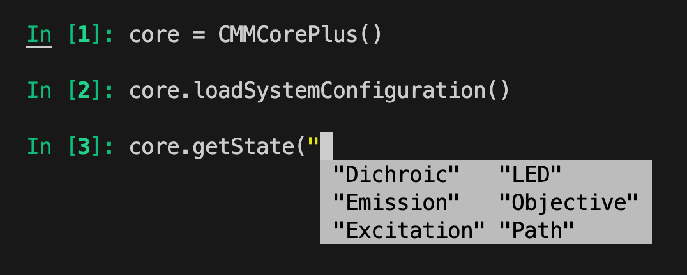

# IPython Tab Completion

`pymmcore-plus` provides an IPython completer that allows you to use
tab-completion for methods on the [`CMMCorePlus`][pymmcore_plus.CMMCorePlus]
object. If you hit `<Tab>` after the parenthesis of a core method that expects the
name of an existing device, you will be presented with suggestions for the names
of loaded devices (of the appropriate type).

You may disable this feature by setting the [environment variable](../env_var.md)
`PYMM_DISABLE_IPYTHON_COMPLETIONS` to `1` before importing `pymmcore_plus`.
