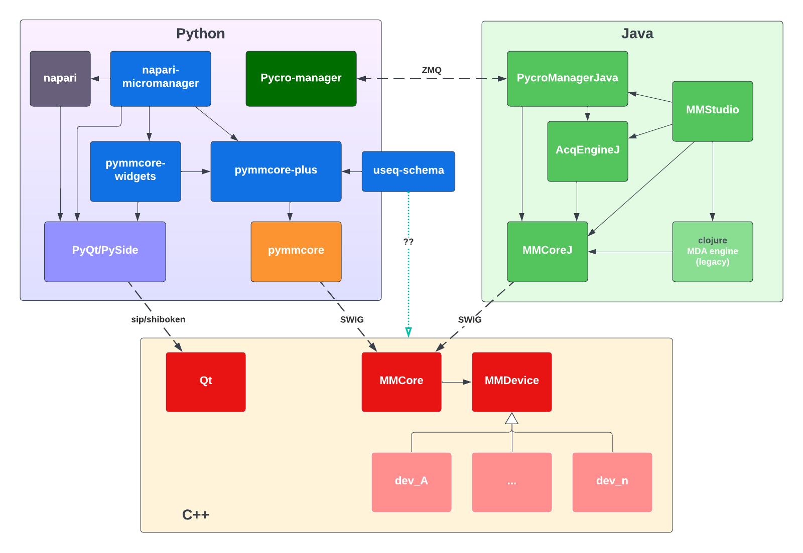

# Overview

`pymmcore-plus` aims to extend
[pymmcore](https://github.com/micro-manager/pymmcore) (python bindings for the
C++ [micro-manager core](https://github.com/micro-manager/mmCoreAndDevices/))
with a number of features designed to facilitate working with **Micro-manager in
pure python/C environments**.

- `pymmcore-plus` itself is a superset of
  [`pymmcore`](https://github.com/micro-manager/pymmcore) (python bindings
  for Micro-manager's C++ `CMMCore`). [`pymmcore_plus.CMMCorePlus`](api/cmmcoreplus.md) (the main object in this library)
  aims to be a drop-in replacement for `pymmcore.CMMCore`, while adding a number
  of additional features including:

    - A multi-dimensional [acquisition engine][pymmcore_plus.CMMCorePlus.run_mda]
      implemented in pure python. (The existing acquisition engines in
      Micro-manager are written in Java and Clojure).
    - More flexible [event](api/events.md) connections and callback handling.
    - Extended convenience APIs for working with core (which would be hard or
      impossible to implement in the `pymmcore` SWIG wrapper).
    - More pythonic APIs for various pymmcore objects (e.g. [`pymmcore_plus.Device`][],
      [`pymmcore_plus.Configuration`][]) and [constants](api/constants.md).

- [`pymmcore-widgets`](https://github.com/pymmcore-plus/pymmcore-widgets) is a
    [Qt](https://www.google.com/search?q=qt)-based widget library built on
    `pymmcore-plus` that provides GUI elements for
    most of the device and acquisition functionality of `pymmcore`.  It
    allows users to build their own custom GUIs for Micro-manager.
- [`napari-micromanager`](https://github.com/pymmcore-plus/napari-micromanager)
    is a plugin for the [napari](https://napari.org/) image viewer that composes
    `pymmcore-plus` and `pymmcore-widgets` to provide a full GUI for
    Micro-manager that is integrated with the napari viewer.

!!! question "How is pymmcore-plus different than Pycro-Manager?"

    A common question about `pymmcore-plus` and related libraries is how it
    differs from [Pycro-Manager](https://github.com/micro-manager/pycro-manager),
    another python library for working with Micro-manager.

    The primary design difference is that Pycro-Manager controls Micro-manager
    via a ZMQ-based RPC connection to a Java process in which the Micro-manager
    GUI is running (or a headless Java process if the GUI is not running). The
    Java process in turn communicates with the C++ core driving the hardware.

    `pymmcore-plus` aims to remove the need for a Java process by communicating
    *directly* with the C++ core (via the `pymmcore` library), and re-implementing
    any necessary event-based or GUI-based functionality in pure python or C.

    An advantage of Pycro-Manager is that you can interact with the entire Java-based micro-manager
    ecosystem, including the GUI and plugins. A disadvantage, however, is that it requires a
    Java runtime environment and cross-process communication and data sharing. If you are
    looking to control a microscope via python without any need for Java, `pymmcore(-plus)` will
    help, and much of the critical GUI components have been re-implented in `pymmcore-widgets`
    and `napari-micromanager`.

    { loading=lazy }

## Quickstart

### Install

Install with `pip` or `conda`:

```bash
pip install pymmcore-plus
# OR
conda install -c conda-forge pymmcore-plus
```

You will also need the micro-manager device adapters on your system.
To get them quickly, you can run:

```bash
mmcore install
```

> *See [install](install) for more details.*

### Usage

The main object is [`pymmcore_plus.CMMCorePlus`][], which is an enhanced subclass
of `pymmcore.CMMCore`:

```python
from pymmcore_plus import CMMCorePlus

# instantiate as you would pymmcore.CMMCore
mmc = CMMCorePlus()
# OR: use the global singleton
# mmc = CMMCorePlus.instance()

# without arguments, this will load the demo config
mmc.loadSystemConfiguration()
```

See the [`CMMCorePlus` API documentation](api/cmmcoreplus.md) for details on
the additional features of `CMMCorePlus`.

!!! tip "`CMMCorePlus.instance`"

    Creating/accessing a `CMMCorePlus` object using
    [`CMMCorePlus.instance()`][pymmcore_plus.CMMCorePlus.instance] is a
    convenient way to access the same core instance from multiple places in your
    code. All widgets in
    [`pymmcore-widgets`](https://github.com/pymmcore-plus/pymmcore-widgets) also use
    `CMMCorePlus.instance()` by default, so any widgets you use will automatically
    connect to the same core instance without any additional configuration.

    Attempts *are* made to make it thread-safe.  But please open an issue
    if you find any problems.

While you can easily use `pymmcore-plus` from a script or IPython/Jupyter you can
also use it in combination with the [napari](https://napari.org/) based gui
[napari-micromanager](https://github.com/pymmcore-plus/napari-micromanager#napari-micromanager).
See [using with napari-micromanager](examples/napari-micromanager) for an
example of how to use them together.

## Contributing

We welcome contributions to `pymmcore-plus` and related libraries.  Please see
[contributing](contributing) for more information.
