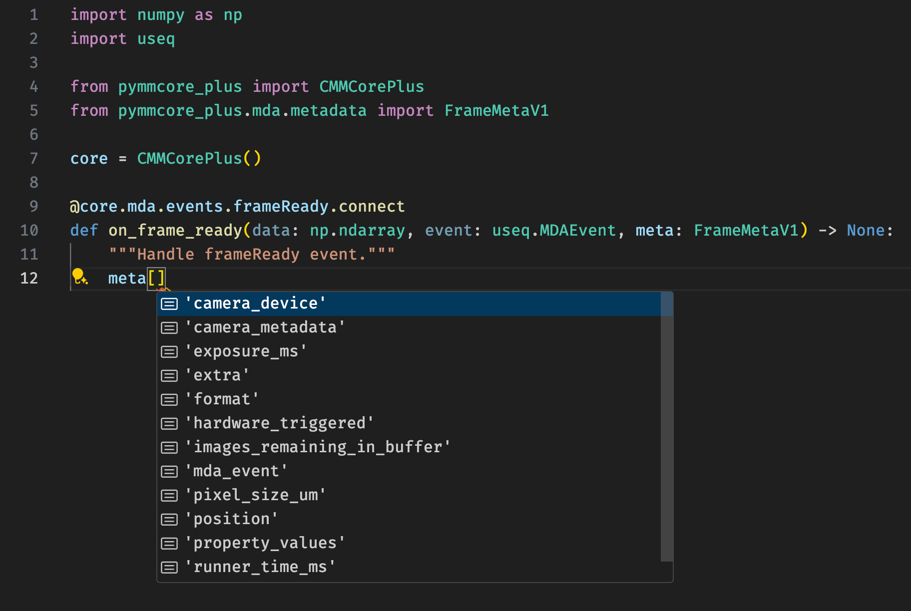

# Metadata Schema

This page defines the schema for the metadata `dicts` emitted during the
course of an [Multi-dimensional Acquisition](./guides/mda_engine.md) (MDA).

These are not classes (and should not be imported outside of a
[`typing.TYPE_CHECKING`][] clause), but rather are [`typing.TypedDict`][]
definitions that outline the structure of objects that are passed to the
[`sequenceStarted`][pymmcore_plus.mda.events.PMDASignaler.sequenceStarted] and
[`frameReady`][pymmcore_plus.mda.events.PMDASignaler.frameReady] callbacks in an
MDA.  One use case for these definitions is to provide type hints for the
arguments to these callbacks, which is both handy for looking up the structure
of the metadata and for static type checking.

## Primary Metadata Types

- [`pymmcore_plus.metadata.SummaryMetaV1`][]
- [`pymmcore_plus.metadata.FrameMetaV1`][]

------------

## Supporting Types

- [`pymmcore_plus.metadata.DeviceInfo`][]
- [`pymmcore_plus.metadata.SystemInfo`][]
- [`pymmcore_plus.metadata.ImageInfo`][]
- [`pymmcore_plus.metadata.ConfigGroup`][]
- [`pymmcore_plus.metadata.ConfigPreset`][]
- [`pymmcore_plus.metadata.PixelSizeConfigPreset`][]
- [`pymmcore_plus.metadata.PropertyInfo`][]
- [`pymmcore_plus.metadata.PropertyValue`][]
- [`pymmcore_plus.metadata.Position`][]
- [`pymmcore_plus.metadata.StagePosition`][]

------------

## Functions

In most cases, the metadata dicts described above will be received as an
argument to either the
[`sequenceStarted`][pymmcore_plus.mda.events.PMDASignaler.sequenceStarted] or
[`frameReady`][pymmcore_plus.mda.events.PMDASignaler.frameReady] callbacks in an
MDA. However, they can also be generated with the following functions.

- [`pymmcore_plus.metadata.summary_metadata`][]
- [`pymmcore_plus.metadata.frame_metadata`][]
