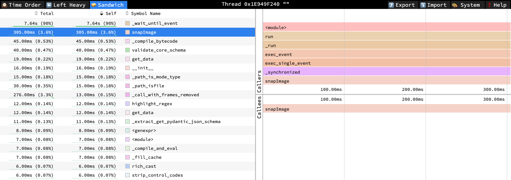

# Performance Profiling

Identifying performance bottlenecks is an important part of the development
process. MMCore coordinates control of many different devices, each of which may
have its own performance characteristics. As a result, performance issues can
vary dramatically depending on the specific hardware configuration and the
operations being performed.

This document provides an overview of some tools and techniques that can be used
to identify and address performance bottlenecks when using pymmcore-plus

## Profiling with py-spy

There are many tools available for profiling Python code. We recommend starting
with [`py-spy`](https://github.com/benfred/py-spy).  You can add it to your
environment with `pip install py-spy`.  For complete usage tips, see the
[`py-spy` readme](https://github.com/benfred/py-spy?tab=readme-ov-file#usage),
but here is a quick example of how to use it with pymmcore-plus:

### Example with python script

Create a Python script that uses pymmcore-plus to perform some operations, such
as instantiating a CMMCorePlus object, loading a configuration, and performing
some task such as running a multi-dimensional acquisition.  Save this script
somewhere (we'll call it `example.py`) and profile it with `py-spy`:

<small><em>Note: py-spy will require sudo access</em></small>

```sh
sudo py-spy record -o profile.json -f speedscope -r 1000 -- python example.py
```

- the `-o profile` flag specifies the output file name
- the `-f speedscope` flag specifies the output format.  Here, we use the
  `speedscope` format, which can be viewed in the [Speedscope](https://www.speedscope.app/)
  web viewer.
- the `-r 1000` flag specifies the sampling rate (in Hz).  The default is 100 Hz, so if
  you want more detailed profiling, you can increase this number as we've done here.
- the `--` separates the `py-spy` arguments from the Python script to be profiled

### Example using `mmcore run`

If you are profiling a standard MDASequence acquisition, you can use the `mmcore run`
command line tool to run the acquisition and profile it with `py-spy`.  First, create
a json/yaml file representing the MDASequence acquisition you want to run:

```python
from useq import MDASequence

seq = MDASequence(
    channels=["DAPI", {"config": "FITC", "exposure": 1}],
    time_plan={"interval": 2, "loops": 5},
    z_plan={"range": 4, "step": 0.5},
    axis_order="tpcz",
)
seq_json = sequence.model_dump_json(exclude_unset=True)

with open("mda_seq.json", "w") as f:
    f.write(seq_json)
```

Then, run the acquisition with `mmcore run` and profile it with py-spy:

```sh
sudo py-spy record -o profile.json -f speedscope -r 1000 -- mmcore run mda_seq.json --config your_mm_config.cfg
```

- the `-o`, `-f`, `-r`, and `--` flags are the same as in the previous example
- the `mmcore run` command runs the acquisition specified in the json file
- the `--config` flag specifies the path to the MMCore configuration file defining your microscope.

### Example attaching to a running process

If you have a running Python process that you want to profile, you can attach
`py-spy` to it using the `-p` flag:

```sh
sudo py-spy record -o profile.json -f speedscope -r 1000 -p <pid>
```

## Analyzing the profile

Once you have a profile, you can view it in the Speedscope web viewer.

Open <https://www.speedscope.app/> and drag the profile file into the window.

See the [Speedscope documentation](https://github.com/jlfwong/speedscope#usage)
for more information.  The "Sandwich" view is particularly useful for identifying
slow functions and hot paths in your code:



Feel free to open an issue with your `profile.json` file if you need help
interpreting the results.
